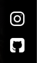

[WeatherApp - Click here](https://thiagotorresferrao.github.io/*******/)

🌦️ **Pagina de visualiçção inicial do jogo Genshin Impact**  
🌍 **Initial viewing page of the game Genshin Impact**

---

## 📌 Descrição | Description

**PT-BR:**  
Está é uma página de apresentação feita para demonstrar o jogo Genshin Impact.

**EN:**  
This is a presentation page created to showcase the game Genshin Impact.

---

## 💻 Tecnologias Utilizadas | Technologies Used

- HTML5
- CSS3
- JavaScript (ES6+)

---

## 🎯 Funcionalidades | Features

✅ Interface responsiva e amigável
✅ Estrutura de arquivos separada por boas práticas

## How it looks?

# On Desktop

  

👨‍💻 Autor | Author

Feito por Thiago Sousa
LinkedIn • Portfólio
📄 Licença | License

Este projeto é de uso livre para fins educacionais.
This project is open for educational and non-commercial use.

## 🌐 Conecte-se comigo

  
  
  
  

